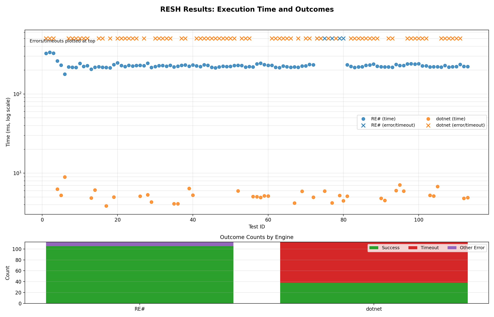
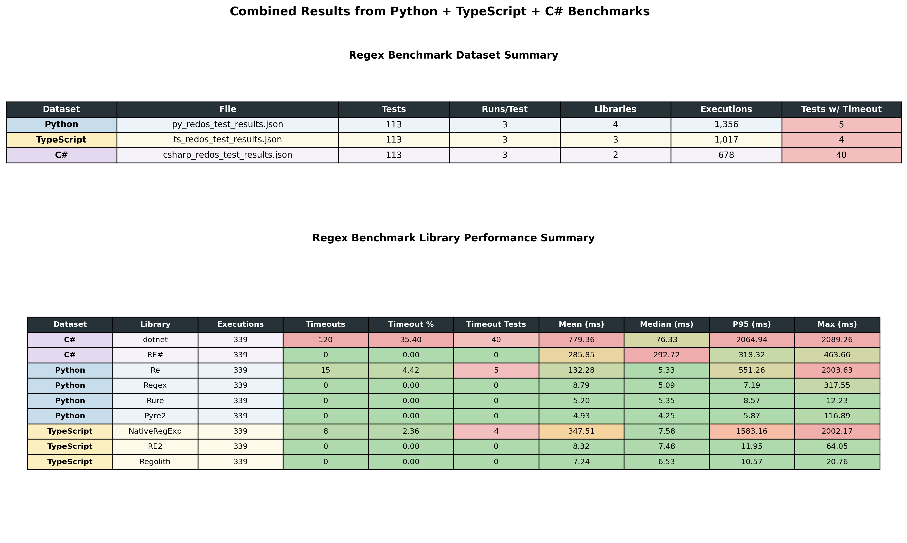

# Many Regex

**Can some linear-time regex engines be considered harmful? A runtime analysis of linear-time regex engines in the context of production software systems.**

- [Poster Draft Document](https://docs.google.com/presentation/d/1hQlY_-CyS-_QAAD-QpMdrhmsrkSrwy6Pu9Qp7P5Rq18/edit?usp=sharing)

## Introduction

Linear-time Regex engines are considered the gold standard for reducing the risk of Regular Expression Denial of Service (ReDoS) attacks. However, engines that operate in linear-time can in theory still cause harm to software systems if the coefficient of the linear runtime is large enough. We investigate if any linear-time Regex engines found in either literature or libraries can be considered harmful in the context of production software systems, by causing a large enough stall in runtime. 

## Included 

1. [Python code](python/main.py) to run a regex pattern with many different libraries
2. [Code](graph.py) to interpret the runtime output
3. A [list of datasets](redos-datasets.md) for ReDoS

## Roadmap

- [x] include Python libraries
- [x] include JavaScript / TypeScript libraries
- [ ] include Go libraries
- [ ] include Rust libraries
- [x] include Re# and Dotnet library
- [x] Vary input size and not just input pattern
- [x] Make table of Regex libraries
- [x] Collect more regex patterns from literature
- [ ] Draft up [poster](https://docs.google.com/presentation/d/1hQlY_-CyS-_QAAD-QpMdrhmsrkSrwy6Pu9Qp7P5Rq18) for initial review
- [x] Make ReDoS test cases JSON

## Harmfulness Scale

## Libraries Tested

| Name        | Language | Claimed to be linear                                                                                   |
| ---         | --       | --                                                                                                     |
| Re          | Python   | No                                                                                                     |
| Dotnet Regex | C#       | No                                                                                                     |
| Regex       | Python   | Reduces backtracking chance but no guarantee                                                           |
| Rure        | Python   | **Yes** "guarantees linear time"                                                                           |
| Pyre2       | Python   | **Yes** "guarantees linear-time behavior"                                                                  |
| RE#         | C#       | **Yes** "the main matching algorithm has input-linear complexity both in theory as well as experimentally" |
| Regolith        | JavaScript   | **Yes** "guarantees linear time"                                                                           |
| RegExp        | Go   | **Yes** "guaranteed to run in time linear"                                                                           |
| Regex        | Rust   | **Yes** "worst time O(m*nt)"                                                                           |

These libraries were picked after I searched for "linear time regex library python". [Re2](https://pypi.org/project/re2/) was removed from the test because it could not be installed. Similarly, [Regexy](https://pypi.org/project/regexy) was archived and out of date, so it too was excluded.

I use Python's default "re" library as a control even though it does not claim to be linear time.

## Experiments ToC

Test 1 and 2 were done in just Python

- [Test 1 -- Scaling Test](#test-1----scaling-test)
- [Test 2 -- Preliminary Results](#test-2----preliminary-results)
- [Test 3 -- Dotnet & RE# Test](#test-3----dotnet--re-test)

## Test 1 -- Scaling Test

#### Methods

Each Regex pattern was run with an input size of 0 to 30 on all 4 of the tested Regex libraries. Each line represents a different Regex library, the y axis represents time on a log scale with a hard timeout at 2 seconds. The regex patterns where created by asking Claude Sonnet 4.5 for regex patterns that may lead to catastrophic backtracking.

Here is an example of one of the tests where both Regex and Re can be considered harmful.

Here is a list of each test run that links to its corresponding graph.

1. [Nested quantifiers (`^(a+)+$`)](images/test_1_performance.png)
2. [Nested quantifiers with Kleene star (`^(a*)*$`)](images/test_2_performance.png)
3. [Nested quantifiers with mismatch (`^(a+)+b$`)](images/test_3_performance.png)
4. [Alternation with overlapping patterns (`^(a|a)*$`)](images/test_4_performance.png)
5. [Alternation with prefix overlap (`^(a|ab)*$`)](images/test_5_performance.png)
6. [Multiple alternations (`(a|a|a|a|a|b)*c`)](images/test_6_performance.png)
7. [Triple nested groups (`^((a+)+)+$`)](images/test_7_performance.png)
8. [Nested Kleene star with suffix (`^(a*)*b$`)](images/test_8_performance.png)
9. [Nested plus with suffix (`^(a+)*b$`)](images/test_9_performance.png)
10. [Email-like pattern (ReDoS)](images/test_10_performance.png)
11. [Overlapping character classes lowercase (`^([a-z]+)+[A-Z]$`)](images/test_11_performance.png)
12. [Overlapping character classes alphanumeric (`^([0-9a-z]+)+[A-Z]$`)](images/test_12_performance.png)
13. [Wildcard nested quantifiers (`^(.*)*$`)](images/test_13_performance.png)
14. [Wildcard plus nested (`^(.+)+$`)](images/test_14_performance.png)
15. [Wildcard with suffix (`^(.*)+b$`)](images/test_15_performance.png)
16. [Multiple overlapping quantifiers (`^(a*)+b$`)](images/test_16_performance.png)
17. [Optional nested quantifiers (`^(a?)+b$`)](images/test_17_performance.png)
18. [Non-greedy nested quantifiers (`^(a*?)*b$`)](images/test_18_performance.png)
19. [Word boundary catastrophic (`^(\\w+\\s*)+$`)](images/test_19_performance.png)
20. [Word with spaces pattern (`^([\\w]+[\\s]*)*$`)](images/test_20_performance.png)
21. [Digit nested plus (`^(\\d+)+$`)](images/test_21_performance.png)
22. [Digit nested star (`^([0-9]+)*$`)](images/test_22_performance.png)
23. [Complex alternation plus (`^(a+|a+)+$`)](images/test_23_performance.png)
24. [Complex alternation star (`^(a*|a*)*$`)](images/test_24_performance.png)
25. [Alternation with length variation (`^(aa+|a+)+$`)](images/test_25_performance.png)
26. [URL pattern (simplified)](images/test_26_performance.png)
27. [Whitespace with letters (`^(\\s*a+\\s*)+$`)](images/test_27_performance.png)
28. [Whitespace alternation (`^(\\s+|a+)*b$`)](images/test_28_performance.png)
29. [Optional group patterns (`^(a+)?b?(a+)?$`)](images/test_29_performance.png)
30. [Optional with nested groups (`^(a+b?)+c$`)](images/test_30_performance.png)
31. [Character class repetition (`^([a-zA-Z]+)*$`)](images/test_31_performance.png)
32. [Alphanumeric with symbol (`^([a-z0-9]+)+[!]$`)](images/test_32_performance.png)
33. [Nested alternation simple (`^((a|b)+)+c$`)](images/test_33_performance.png)
34. [Nested alternation overlap (`^((a|ab)+)+c$`)](images/test_34_performance.png)
35. [Long repeating with suffix (`^(a+b)+c$`)](images/test_35_performance.png)
36. [Repeating pattern variation (`^(ab+)+c$`)](images/test_36_performance.png)

#### Results

| Name  | Language | Claimed to be linear                         | Found to be harmful | Quantity of harmful results (out of 36) |
| ---   | --       | --                                           | --                  | --                                      |
| Re    | Python   | No                                           | Yes                 | 25                                      |
| Rure  | Python   | Yes "guarantees linear time"                 | No                  | 0                                       |
| Regex | Python   | Reduces backtracking chance but no guarantee | Yes                 | 1                                       |
| Pyre2 | Python   | Yes "guarantees linear-time behavior"        | No                  | 0                                       |

## Test 2 -- Preliminary Results

This was the first test I ran where each pattern was run with a single input size. These results are preliminary and were to test if I was using a reasonable method for running regex patterns.

## Test 3 -- Dotnet & RE# Test

We run [Program.cs](./csharp/Program.cs) with `dotnet run`. This tests runs 113 tests in both the RE# library and the default Dotnet Regex library. The RE# library has zero cases that can be considered harmful, but 75 cases that can be conspired harmful. Those results are expected, as the Dotnet Regex library does not claim to be linear-time and RE# does claim to be linear.

Included are the [full results](./csharp/results.txt).

## Test 4 -- Check Python, TypeScript (bun runtime), and C# (.NET)

I standardized the tests into a JSON file called [test_cases.json](./test_cases.json) and changed how test cases are handled in Python, TS, and C# to use this test case file. I ran each language on these test cases and to get the results [py_redos_test_results.json](./py_redos_test_results.json), [ts_redos_test_results.json](./ts_redos_test_results.json), [csharp_redos_test_results.json](./csharp_redos_test_results.json). I then created [results_table.py](./results_table.py) that produced a few graphs and tables.

## Notes

I had an issue installing https://pypi.org/project/re2.

I found a pull request from one of the authors of resharp where they optimize the dotnet regex library https://github.com/dotnet/runtime/pull/102655

The source code for resharp has been moved or removed https://github.com/ieviev/resharp

You can install it from the library website https://www.nuget.org/packages/Resharp
