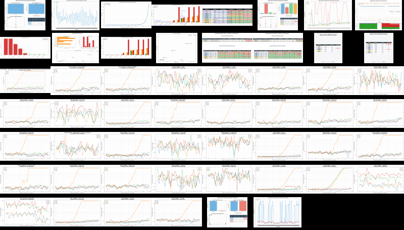
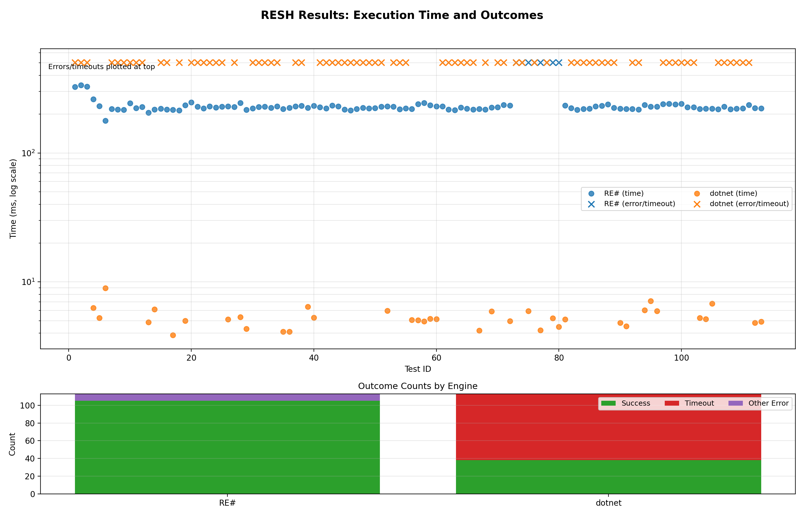
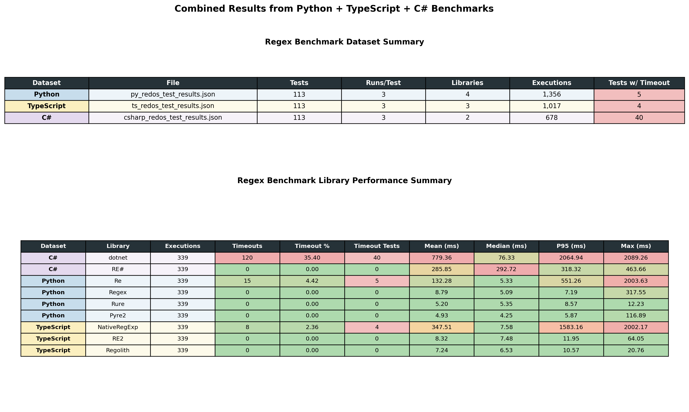
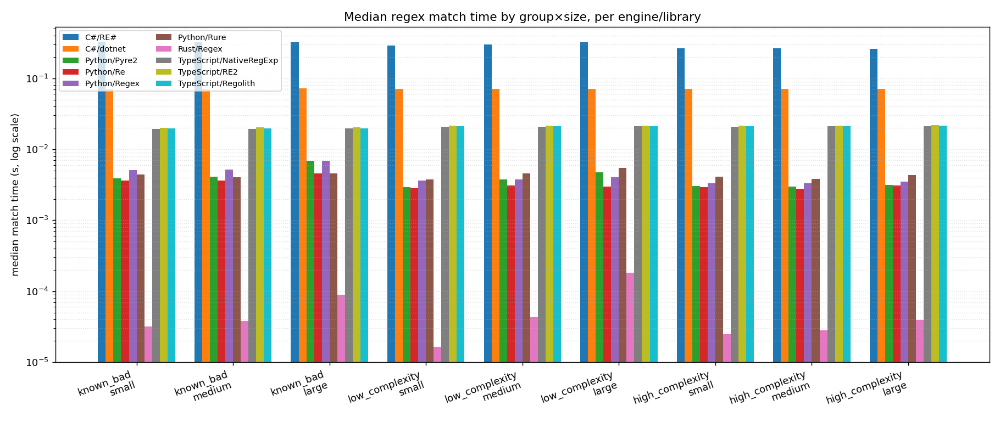
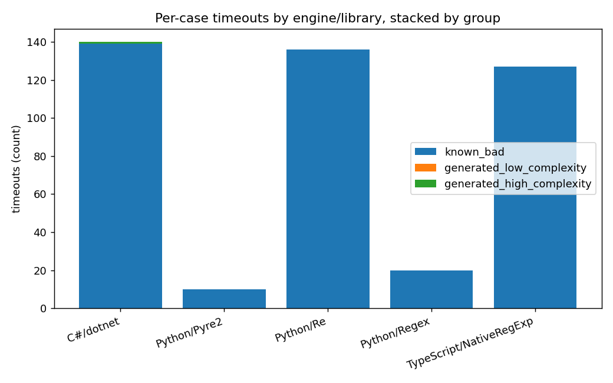
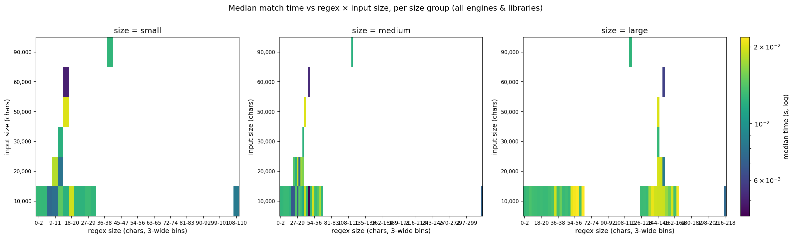
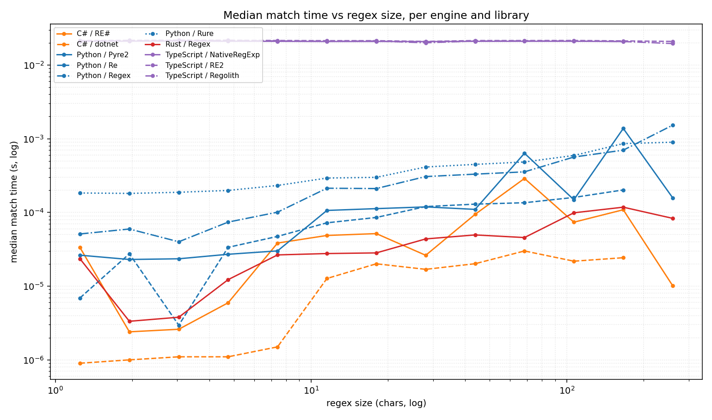

---

**Can some linear-time regex engines be considered harmful? A runtime analysis of linear-time regex engines in the context of production software systems.**

## Quick Related Links

- [Poster SQ2025](https://jr0.org/images/redos-research.png)
- [Poster Draft Document](https://docs.google.com/presentation/d/1hQlY_-CyS-_QAAD-QpMdrhmsrkSrwy6Pu9Qp7P5Rq18/edit?usp=sharing)
- [URC Talk](https://youtu.be/wvvvvJwWor4)
- [Regolith](https://github.com/JakeRoggenbuck/regolith)

## Introduction

Linear-time Regex engines are considered the gold standard for reducing the risk of Regular Expression Denial of Service (ReDoS) attacks. However, engines that operate in linear-time can in theory still cause harm to software systems if the coefficient of the linear runtime is large enough. We investigate if any linear-time Regex engines found in either literature or libraries can be considered harmful in the context of production software systems, by causing a large enough stall in runtime. 

## ReDoS Found

> [!IMPORTANT]
> ReDoS Vulnerability Found! Use the following one-liner to run it if you have [uv](https://docs.astral.sh/uv) installed.

This code should timeout, as it tries to compute an exponentially large Regex.

```sh
uv run --with pyre2==0.3.10 python -c "import re2 as pyre2; pyre2.match('^(?=(a+)+b)\\w+$', 'a' * 50)"
```

You can also run [run_pyre2_timeout_simple.py](./python/run_pyre2_timeout_simple.py) to see proof of concept.


## HATRA

I will be submitting to [HATRA 2026](https://conf.researchr.org/home/splash-issta-2026/hatra-2026).

**Work to be done:**

1. Create a system to measure the following for a regex and input pair:

- memory usage
- regex match time
- regex compile time (input independent)
- AST depth (input independent)
- number of loops (input independent)

2. What is the reality* and max* of the input + regex for top 30 packages in two linear regex engines

- reality is defined as the normal situation that this regex will be used in
- max is defined as the most extreme case of regex operation permitted by the other code (ex. input lenght truncation)

The first round of this work is done -- see [Test 5](#test-5----hatra-experiment-group-x-size-dataset-across-four-languages) for the dataset, runners, and results, and [experiment-design-notes.md](experiment-design-notes.md) for how the dataset was built.

## Included

1. [Python code](python/) to run regex patterns against many different Python libraries (`main.py`, `run_pyre2_timeout_simple.py`, `run_pyre2_timeout10_large.py`, `test_pyre2_on_36.py`, etc.)
2. [C# code](csharp/Program.cs) to test the default Dotnet Regex library and RE# (with [full results](csharp/results.txt))
3. [TypeScript code](typescript/) to test regex libraries under the Bun runtime
4. [Rust code](rust/src/main.rs) to test the `regex` crate, including a runner for the [HATRA dataset](experiment-dataset/)
5. [Test cases JSON](test_cases.json) — the standardized ReDoS test cases used across Python, TypeScript, and C#
6. [Graphing tools](graphing-tools/) to interpret and visualize the runtime output (`graph.py`, `graph_scaling.py`, `graph_resh_results.py`, `results_table.py`, etc.)
7. [JSON result data](json-data/) for each language and timeout setting (`py_redos_test_results.json`, `ts_redos_test_results.json`, `csharp_redos_test_results.json`, scaling tests, and timeout variants)
8. [Images](images/) — graphs, tables, and figures referenced throughout this README

   
9. A [list of datasets](redos-datasets.md) for ReDoS
10. The [HATRA experiment dataset](experiment-dataset/) (1017 regex/input cases, see [design notes](experiment-design-notes.md)), the [scripts that build, run, and aggregate it](misc-scripts/) (`build_dataset.py`, `run_all_engines.sh`, `aggregate_results.py`, `plot_heatmaps.py`, `plot_size_vs_time.py`), and its [results and graphs](experiment-results/)

## Roadmap

- [x] include Python libraries
- [x] include JavaScript / TypeScript libraries
- [ ] include Go libraries
- [x] include Rust libraries
- [x] include Re# and Dotnet library
- [x] Vary input size and not just input pattern
- [x] Make table of Regex libraries
- [x] Collect more regex patterns from literature
- [ ] Draft up [poster](https://docs.google.com/presentation/d/1hQlY_-CyS-_QAAD-QpMdrhmsrkSrwy6Pu9Qp7P5Rq18) for initial review
- [x] Make ReDoS test cases JSON
- [ ] Run scaling on tests in `./python/run_pyre2_timeout10_large.py` to check for exponential behavior

## Harmfulness Scale


## Libraries Tested

| Name        | Language | Claimed to be linear                                                                                   |
| ---         | --       | --                                                                                                     |
| Re          | Python   | No                                                                                                     |
| Dotnet Regex | C#       | No                                                                                                     |
| Regex       | Python   | Reduces backtracking chance but no guarantee                                                           |
| Rure        | Python   | **Yes** "guarantees linear time"                                                                           |
| Pyre2       | Python   | **Yes** "guarantees linear-time behavior"                                                                  |
| RE#         | C#       | **Yes** "the main matching algorithm has input-linear complexity both in theory as well as experimentally" |
| Regolith        | JavaScript   | **Yes** "guarantees linear time"                                                                           |
| RegExp        | Go   | **Yes** "guaranteed to run in time linear"                                                                           |
| Regex        | Rust   | **Yes** "worst time O(m*nt)"                                                                           |

These libraries were picked after I searched for "linear time regex library python". [Re2](https://pypi.org/project/re2/) was removed from the test because it could not be installed. Similarly, [Regexy](https://pypi.org/project/regexy) was archived and out of date, so it too was excluded.

I use Python's default "re" library as a control even though it does not claim to be linear time.

## Experiments ToC

Test 1 and 2 were done in just Python

- [Test 1 -- Scaling Test](#test-1----scaling-test)
- [Test 2 -- Preliminary Results](#test-2----preliminary-results)
- [Test 3 -- Dotnet & RE# Test](#test-3----dotnet--re-test)
- [Test 4 -- Check Python, TypeScript (bun runtime), and C# (.NET)](#test-4----check-python-typescript-bun-runtime-and-c-net)
- [Test 5 -- HATRA Experiment: Group x Size Dataset Across Four Languages](#test-5----hatra-experiment-group-x-size-dataset-across-four-languages)

## Test 1 -- Scaling Test

#### Methods

Each Regex pattern was run with an input size of 0 to 30 on all 4 of the tested Regex libraries. Each line represents a different Regex library, the y axis represents time on a log scale with a hard timeout at 2 seconds. The regex patterns where created by asking Claude Sonnet 4.5 for regex patterns that may lead to catastrophic backtracking.

Here is an example of one of the tests where both Regex and Re can be considered harmful.


Here is a list of each test run that links to its corresponding graph.

1. [Nested quantifiers (`^(a+)+$`)](images/test_1_performance.png)
2. [Nested quantifiers with Kleene star (`^(a*)*$`)](images/test_2_performance.png)
3. [Nested quantifiers with mismatch (`^(a+)+b$`)](images/test_3_performance.png)
4. [Alternation with overlapping patterns (`^(a|a)*$`)](images/test_4_performance.png)
5. [Alternation with prefix overlap (`^(a|ab)*$`)](images/test_5_performance.png)
6. [Multiple alternations (`(a|a|a|a|a|b)*c`)](images/test_6_performance.png)
7. [Triple nested groups (`^((a+)+)+$`)](images/test_7_performance.png)
8. [Nested Kleene star with suffix (`^(a*)*b$`)](images/test_8_performance.png)
9. [Nested plus with suffix (`^(a+)*b$`)](images/test_9_performance.png)
10. [Email-like pattern (ReDoS)](images/test_10_performance.png)
11. [Overlapping character classes lowercase (`^([a-z]+)+[A-Z]$`)](images/test_11_performance.png)
12. [Overlapping character classes alphanumeric (`^([0-9a-z]+)+[A-Z]$`)](images/test_12_performance.png)
13. [Wildcard nested quantifiers (`^(.*)*$`)](images/test_13_performance.png)
14. [Wildcard plus nested (`^(.+)+$`)](images/test_14_performance.png)
15. [Wildcard with suffix (`^(.*)+b$`)](images/test_15_performance.png)
16. [Multiple overlapping quantifiers (`^(a*)+b$`)](images/test_16_performance.png)
17. [Optional nested quantifiers (`^(a?)+b$`)](images/test_17_performance.png)
18. [Non-greedy nested quantifiers (`^(a*?)*b$`)](images/test_18_performance.png)
19. [Word boundary catastrophic (`^(\\w+\\s*)+$`)](images/test_19_performance.png)
20. [Word with spaces pattern (`^([\\w]+[\\s]*)*$`)](images/test_20_performance.png)
21. [Digit nested plus (`^(\\d+)+$`)](images/test_21_performance.png)
22. [Digit nested star (`^([0-9]+)*$`)](images/test_22_performance.png)
23. [Complex alternation plus (`^(a+|a+)+$`)](images/test_23_performance.png)
24. [Complex alternation star (`^(a*|a*)*$`)](images/test_24_performance.png)
25. [Alternation with length variation (`^(aa+|a+)+$`)](images/test_25_performance.png)
26. [URL pattern (simplified)](images/test_26_performance.png)
27. [Whitespace with letters (`^(\\s*a+\\s*)+$`)](images/test_27_performance.png)
28. [Whitespace alternation (`^(\\s+|a+)*b$`)](images/test_28_performance.png)
29. [Optional group patterns (`^(a+)?b?(a+)?$`)](images/test_29_performance.png)
30. [Optional with nested groups (`^(a+b?)+c$`)](images/test_30_performance.png)
31. [Character class repetition (`^([a-zA-Z]+)*$`)](images/test_31_performance.png)
32. [Alphanumeric with symbol (`^([a-z0-9]+)+[!]$`)](images/test_32_performance.png)
33. [Nested alternation simple (`^((a|b)+)+c$`)](images/test_33_performance.png)
34. [Nested alternation overlap (`^((a|ab)+)+c$`)](images/test_34_performance.png)
35. [Long repeating with suffix (`^(a+b)+c$`)](images/test_35_performance.png)
36. [Repeating pattern variation (`^(ab+)+c$`)](images/test_36_performance.png)

#### Results

| Name  | Language | Claimed to be linear                         | Found to be harmful | Quantity of harmful results (out of 36) |
| ---   | --       | --                                           | --                  | --                                      |
| Re    | Python   | No                                           | Yes                 | 25                                      |
| Rure  | Python   | Yes "guarantees linear time"                 | No                  | 0                                       |
| Regex | Python   | Reduces backtracking chance but no guarantee | Yes                 | 1                                       |
| Pyre2 | Python   | Yes "guarantees linear-time behavior"        | No                  | 0                                       |

## Test 2 -- Preliminary Results

This was the first test I ran where each pattern was run with a single input size. These results are preliminary and were to test if I was using a reasonable method for running regex patterns.

<table>
<tr>
<td></td>
<td></td>
</tr>
</table>

## Test 3 -- Dotnet & RE# Test

We run [Program.cs](./csharp/Program.cs) with `dotnet run`. This tests runs 113 tests in both the RE# library and the default Dotnet Regex library. The RE# library has zero cases that can be considered harmful, but 75 cases that can be conspired harmful. Those results are expected, as the Dotnet Regex library does not claim to be linear-time and RE# does claim to be linear.



Included are the [full results](./csharp/results.txt).

## Test 4 -- Check Python, TypeScript (bun runtime), and C# (.NET)

I standardized the tests into a JSON file called [test_cases.json](./test_cases.json) and changed how test cases are handled in Python, TS, and C# to use this test case file. I ran each language on these test cases and to get the results [py_redos_test_results.json](./py_redos_test_results.json), [ts_redos_test_results.json](./ts_redos_test_results.json), [csharp_redos_test_results.json](./csharp_redos_test_results.json). I then created [results_table.py](./results_table.py) that produced a few graphs and tables.



A few takeaways:

1. C# Regex is very vulnerable to ReDoS compared to the other languages, failing in 40 test cases for each 3 of the runs
2. We did not find evidence that any library that [claimed to be linear-time](#libraries-tested) can be considered harmful

## Test 5 -- HATRA Experiment: Group x Size Dataset Across Four Languages

#### Methods

For the [HATRA](#hatra) submission I built a 1017-case [dataset](experiment-dataset/) (described in [experiment-design-notes.md](experiment-design-notes.md)) that crosses three regex *groups* with three *sizes*, 113 cases each:

- `known_bad` — the 113 hand-curated ReDoS regexes from [test_cases.json](test_cases.json), grown by repeating the regex core
- `generated_low_complexity` — shallow-AST regexes with long `a`-literal runs, generated with [freak](https://github.com/lucasdu2/freak)
- `generated_high_complexity` — regexes generated from freak's full grammar at AST depths of 3, 5, and 7

Every case pairs a regex with a fixed 10,000-character input and records `regex_size`, `input_size`, `ast_size`, and `ast_depth` (computed uniformly via Python's `re._parser`) so the groups can be compared on the same metrics. I also added a [Rust runner](rust/src/main.rs) using the `regex` crate — finally checking off "include Rust libraries" on the [roadmap](#roadmap) — alongside the existing Python, TypeScript, and C# runners.

[run_all_engines.sh](misc-scripts/run_all_engines.sh) drives all four engines over the dataset sequentially with a 2 second per-case timeout, then [aggregate_results.py](misc-scripts/aggregate_results.py), [plot_heatmaps.py](misc-scripts/plot_heatmaps.py), and [plot_size_vs_time.py](misc-scripts/plot_size_vs_time.py) combine the per-engine result JSONs into the [summary stats](experiment-results/summary.json) and graphs below.

#### Results

<table>
<tr>
<td></td>
<td></td>
</tr>
<tr>
<td></td>
<td></td>
</tr>
</table>

| Engine     | Library      | Median time (`known_bad`/large) | Timeouts (out of 1017) |
| ---        | --           | --                              | --                     |
| Rust       | Regex        | 87us                            | 0                      |
| Python     | Rure         | 4.6ms                           | 0                      |
| Python     | Pyre2        | 7.0ms                           | 10                     |
| Python     | Regex        | 6.9ms                           | 20                     |
| Python     | Re           | 4.6ms                           | 136                    |
| TypeScript | RE2          | 20.3ms                          | 0                      |
| TypeScript | Regolith     | 19.7ms                          | 0                      |
| TypeScript | NativeRegExp | 19.5ms                          | 127                    |
| C#         | RE#          | 323.2ms                         | 0                      |
| C#         | dotnet       | 71.9ms                          | 140                    |

As the heatmap and size-vs-time graphs above show, match time scales with regex size and group, not just input size. The [full per-engine summary](experiment-results/summary.txt) and raw [per-case results](json-data/rust_redos_test_results_dataset.json) are also included.

A few takeaways:

1. Rust's `regex` crate is dramatically faster than every other engine tested — tens of microseconds vs. single-digit-to-hundreds of milliseconds — and, being linear-time itself, it had zero timeouts across all 1017 cases
2. Every library that [claims to be linear-time](#libraries-tested) — Rure, Pyre2 (mostly), RE2, Regolith, and RE# — had zero or near-zero timeouts, while Re, Python's `Regex`, NativeRegExp, and dotnet (none of which guarantee linear time) each timed out on dozens to over a hundred cases
3. This is consistent with [Test 4](#test-4----check-python-typescript-bun-runtime-and-c-net): across a much larger and more varied dataset, we still find no evidence that a library which claims linear-time matching can be considered harmful

## Notes

I had an issue installing https://pypi.org/project/re2.

I found a pull request from one of the authors of resharp where they optimize the dotnet regex library https://github.com/dotnet/runtime/pull/102655

The source code for resharp has been moved or removed https://github.com/ieviev/resharp

You can install it from the library website https://www.nuget.org/packages/Resharp
